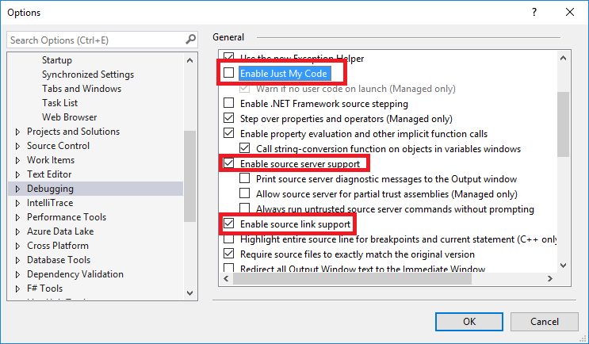

Generalmente no se necesita, depurar el código fuente de Kontecg mientras que se depura su proyecto.

Todos los paquetes de Kontecg son **[enlazados al código fuente](https://github.com/ctaggart/SourceLink)** en el repositorio. Eso significa que puede depurar los paquetes **Kontecg.\*** dentro de su proyecto. Para habilitarlo, cambia las opciones de depuración de Visual Studio (2017+) como sigue:

Una vez habilitado, puede tracear dentro (F11) del código fuente de Kontecg.

 
