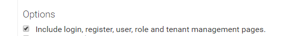

### User Entity

The User entity represents a **user of the application**. It should be
derived from the **KontecgUser** class as shown below:

    public class User : KontecgUser<Company, User>
    {
        //add your own user properties here
    }

This class will be created when you download an kontecg template with the option in the below image is selected.

Users are
stored in the **KontecgUsers** table in the database. You can add custom
properties to the User class (and create database migrations for the
changes).

The KontecgUser class defines some base properties. Some of the properties are:

-   **UserName**: Login name of the user. Should be **unique** for a
    [company](/Pages/Documents/Zero/Company-Management).
-   **EmailAddress**: Email address of the user. Should be **unique**
    for a [company](/Pages/Documents/Zero/Company-Management).
-   **Password**: Hashed password of the user.
-   **IsActive**: True, if this user can login to the application.
-   **Name** and **Surname** of the user.

There are also some properties like **Roles**, **Permissions**,
**Company**, **Settings**, **IsEmailConfirmed**, and so on. Check the KontecgUser
class for more information.

The KontecgUser class is inherited from **FullAuditedEntity**. That means it has
creation, modification and deletion audit properties. It's also implements
**[Soft-Delete](/Pages/Documents/Data-Filters#isoftdelete)** , so
when we delete a user, it's not deleted from database, just marked as
deleted.

The KontecgUser class implements the
[IMayHaveCompany](/Pages/Documents/Data-Filters#imayhavecompany) filter
to properly work in a multi-company application.

Finally, the **Id** of the User is defined as **long**.

### User Manager

**UserManager** is a service to perform **domain logic** for users:

    public class UserManager : KontecgUserManager<Company, Role, User>
    {
        //...
    }

You can [inject](/Pages/Documents/Dependency-Injection) and use
UserManager to create, delete, update users, grant permissions, change
roles for users and much more. You can add your own methods here. Also,
you can **override** any method of the **KontecgUserManager** base class for
your own needs.

#### Multi-Company

*If you're not creating a multi-company application, you can skip this
section. See the [multi-company documentation](../Multi-Company.md) for
more information about multi-company.*

UserManager is designed to work for a **single company** at a time. It
works with the **current company** by default. Let's see some usages of
the UserManager:

    public class MyTestAppService : ApplicationService
    {
        private readonly UserManager _userManager;
    
        public MyTestAppService(UserManager userManager)
        {
            _userManager = userManager;
        }
    
        public void TestMethod_1()
        {
            //Find a user by email for current company
            var user = _userManager.FindByEmail("sampleuser@aspnetboilerplate.com");
        }
    
        public void TestMethod_2()
        {
            //Switch to company 42
            CurrentUnitOfWork.SetFilterParameter(KontecgDataFilters.MayHaveCompany, KontecgDataFilters.Parameters.CompanyId, 42);
    
            //Find a user by email for company 42
            var user = _userManager.FindByEmail("sampleuser@aspnetboilerplate.com");
        }
    
        public void TestMethod_3()
        {
            //Disabling MayHaveCompany filter, so we can reach all users
            using (CurrentUnitOfWork.DisableFilter(KontecgDataFilters.MayHaveCompany))
            {
                //Now, we can search for a username in all companys
                var users = _userManager.Users.Where(u => u.UserName == "sampleuser").ToList();
    
                //Or we can add CompanyId filter if we want to search for a specific company
                var user = _userManager.Users.FirstOrDefault(u => u.CompanyId == 42 && u.UserName == "sampleuser");
            }
        }
    }

#### User Login

Module Zero defines LoginManager which has a **LoginAsync** method used
for logging into the application. It checks all logic for the login and returns a
login result. The LoginAsync method also **automatically saves all login
attempts** to the database (even if it's a failed attempt). You can use the
**UserLoginAttempt** entity to query it.

#### About IdentityResults

Some methods of UserManager return IdentityResult as a result instead of
throwing exceptions for some cases. This is the nature of ASP.NET Identity
Framework. Module Zero also follows it, so we should check this
returning result object to know if the operation succeeded.

Module Zero defines the **CheckErrors** extension method that automatically
checks errors and throws an exception (a localized
[UserFriendlyException](/Pages/Documents/Handling-Exceptions#userfriendlyexception))
if needed. Example usage:

    (await UserManager.CreateAsync(user)).CheckErrors();

To get localized exceptions, we must provide a
[ILocalizationManager](/Pages/Documents/Localization) instance:

    (await UserManager.CreateAsync(user)).CheckErrors(LocalizationManager);

### External Authentication

The Login method of Module Zero authenticates a user from the **KontecgUsers**
table in the database. Some applications may require you to authenticate
users from some external sources (like active directory, from another
database's tables, or even from a remote service).

For such cases, UserManager defines an extension point named 'external
authentication source'. We can create a class derived from
**IExternalAuthenticationSource** and register it to the configuration.
There is a **DefaultExternalAuthenticationSource** class to simplify
the implementation of IExternalAuthenticationSource. Let's see an example:

    public class MyExternalAuthSource : DefaultExternalAuthenticationSource<Company, User>,  ITransientDependency
    {
        public override string Name
        {
            get { return "MyCustomSource"; }
        }
    
        public override Task<bool> TryAuthenticateAsync(string userNameOrEmailAddress, string plainPassword, Company company)
        {
            //TODO: authenticate user and return true or false
        }
    }

In the TryAuthenticateAsync method, we can check the username and password from
some source and return true if a given user is authenticated by it.
We can also override the CreateUser and UpdateUser methods to
control user creation and updating for this source.

When a user is authenticated by an external source, Module Zero checks if
this user exists in the database (KontecgUsers table). If not, it calls
CreateUser to create the user, otherwise it calls UpdateUser to allow the
authentication source to update existing user information.

We can define more than one external authentication source in an
application. The KontecgUser entity has an AuthenticationSource property that
shows which source authenticated this user.

To register our authenciation source, we can use some code like this in the
[PreInitialize](/Pages/Documents/Module-System) method of our module:

    Configuration.Modules.Zero().UserManagement.ExternalAuthenticationSources.Add<MyExternalAuthSource>();

#### LDAP/Active Directory

LdapAuthenticationSource is an implementation of external authentication
to make users login with their LDAP (active directory) username and
password.

If we want to use LDAP authentication, we must first add the
[Kontecg.Zero.Ldap](https://www.nuget.org/packages/Kontecg.Zero.Ldap) NuGet
package to our project (generally to the Core (domain) project). We then
must extend the **LdapAuthenticationSource** for our application as shown
below:

    public class MyLdapAuthenticationSource : LdapAuthenticationSource<Company, User>
    {
        public MyLdapAuthenticationSource(ILdapSettings settings, IKontecgZeroLdapModuleConfig ldapModuleConfig)
            : base(settings, ldapModuleConfig)
        {
        }
    }

Lastly, we must set a module dependency to **KontecgZeroLdapModule** and
**enable** LDAP with the auth source created above:

    [DependsOn(typeof(KontecgZeroLdapModule))]
    public class MyApplicationCoreModule : KontecgModule
    {
        public override void PreInitialize()
        {
            Configuration.Modules.ZeroLdap().Enable(typeof (MyLdapAuthenticationSource));    
        }
    
        ...
    }

After these steps, the LDAP module will be enabled for your application, but
LDAP auth is not enabled by default. We can enable it using the settings.

##### Settings

The **LdapSettingNames** class defines constants for setting names. You can
use these constant names while changing settings (or getting settings).
LDAP settings are **per-company** (for multi-company applications), so
different companys have different settings (see the setting definitions on
[github](https://github.com/aspnetboilerplate/module-zero/blob/master/src/Kontecg.Zero.Ldap/Ldap/Configuration/LdapSettingProvider.cs)). 

As you can see in the MyLdapAuthenticationSource **constructor**,
LdapAuthenticationSource expects **ILdapSettings** as a constructor
argument. This interface is used to get the LDAP settings like domain, user
name and password to connect to Active Directory. The default implementation
(**LdapSettings** class) gets these settings from the [setting
manager](/Pages/Documents/Setting-Management).

If you work with Setting manager, then there's no problem. You can change the LDAP
settings using the [setting manager
API](/Pages/Documents/Setting-Management). If you want, you can add some
initial seed data to the database to enable LDAP auth by default.

Note: If you don't define a domain, username and password, LDAP
authentication works for the current domain if your application runs in a
domain with appropriate privileges.

##### Custom Settings

If you want to define another setting source, you can implement a custom
ILdapSettings class as shown below:

    public class MyLdapSettings : ILdapSettings
    {
        public async Task<bool> GetIsEnabled(int? companyId)
        {
            return true;
        }
    
        public async Task<ContextType> GetContextType(int? companyId)
        {
            return ContextType.Domain;
        }
    
        public async Task<string> GetContainer(int? companyId)
        {
            return null;
        }
    
        public async Task<string> GetDomain(int? companyId)
        {
            return null;
        }
    
        public async Task<string> GetUserName(int? companyId)
        {
            return null;
        }
    
        public async Task<string> GetPassword(int? companyId)
        {
            return null;
        }
    }

Then register it to IOC in PreInitialize method of your module:

    [DependsOn(typeof(KontecgZeroLdapModule))]
    public class MyApplicationCoreModule : KontecgModule
    {
        public override void PreInitialize()
        {
            IocManager.Register<ILdapSettings, MyLdapSettings>(); //change default setting source
            Configuration.Modules.ZeroLdap().Enable(typeof (MyLdapAuthenticationSource));
        }
    
        ...
    }

Then you can get the LDAP settings from another source.

#### Social Logins

See the [social authentication](https://docs.microsoft.com/en-us/aspnet/core/security/authentication/social/)
document for more info about social logins.
